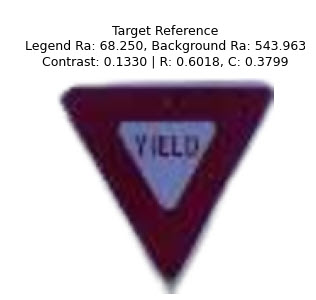
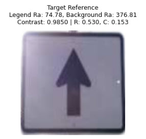
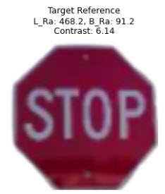

### Overview

This project provides a comprehensive framework for generating and analyzing synthetic traffic sign images, specifically focusing on **Yield signs, Stop signs, and Upward Arrow signs**. It adheres to MUTCD (Manual on Uniform Traffic Control Devices) safety standards, leveraging **Google Colab** for execution and requiring **Google Drive** to be mounted for efficient file management and persistent storage.

  * The core of this project involves generating a diverse **dataset** of these three traffic sign types.
  * This generation is performed by a **Conditional Generative Adversarial Network (GAN)**, which creates realistic replicas based on original field-measured retro-reflectivity and contrast values.
  * Subsequently, a separate **Convolutional Neural Network (CNN)** is trained on this generated dataset to determine if a traffic sign is safe or unsafe by analyzing its image.
  * The project also incorporates robust **directory services** to manage the generated image files and other project assets within the Colab environment.

### Motivating Research
Deep Learning-Based Computer Vision Framework for Predicting Retroreflectivity of Road Signs
https://rosap.ntl.bts.gov/view/dot/83805

**Importance for Safety:**

  * This project is crucial for road safety as it addresses the challenge of acquiring diverse and representative datasets for training robust computer vision models.
  * By synthesizing signs under various conditions (e.g., different lighting, degradation levels, and material properties that affect reflectivity and contrast), we can train AI systems to accurately detect and classify traffic signs even when they are partially obscured, faded, or otherwise compromised.
  * This directly contributes to safer autonomous driving systems and improved traffic infrastructure monitoring.

---

### Reference Traffic Signs

Here are the reference images for the traffic sign types used in this project:

| Yield Sign | Upward Arrow Sign | Stop Sign |
| :----------------------: | :-----------------------: | :---------------------: |
|  |  |  |

---

### Installation

To set up the environment in Google Colab, execute the following command to install the necessary Python packages:

```bash
pip install torch torchvision opencv-python wget matplotlib pillow
```

You will also need to mount your Google Drive at the beginning of your Colab session to ensure the project can access and save files for persistent storage.

### Dataset Generation

The synthetic dataset for **Yield, Stop, and Upward Arrow signs** is generated by controlling three key parameters for each replica. These parameters are directly informed by or represent **field-measured retro-reflectivity and contrast values**, serving as explicit "rules" or conditions for the GAN to follow during image synthesis:

  * **Legend Reflectivity (Legend\_Ra)**: The light reflected from the text or symbol on the sign.
  * **Background Reflectivity (Background\_Ra)**: The light reflected from the sign's background.
  * **Contrast (Contrast\_val)**: The ratio of reflectivity between the legend and the background.

The `generate_balanced_parameters` function ensures a balanced distribution of "SAFE" and "UNSAFE" signs for each type. The classification of a sign as "SAFE" or "UNSAFE" in the dataset is strictly determined by comparing these generated reflectivity and contrast parameters against predefined **MUTCD minimum thresholds**. This rule-based labeling of "SAFE" vs. "UNSAFE" for each generated image forms the ground truth for training the downstream CNN classifier.

**Replication Variance Trade-offs:**

  * When generating replicas, there's a crucial **trade-off between subtle and coarse variances**.
      * **Subtle variances** involve small changes in reflectivity and contrast that mimic realistic, gradual degradation (e.g., slight fading over time). These are important for training classifiers to be robust to real-world, nuanced conditions.
      * **Coarse variances** involve significant deviations from MUTCD standards, creating signs that are clearly non-compliant (e.g., extremely low contrast or very dim reflectivity). These are vital for ensuring a classifier can unequivocally identify highly unsafe signs.
  * The project balances these by carefully defining parameter ranges (e.g., `LEGEND_RA_RANGE`, `BACKGROUND_RA_RANGE`, `CONTRAST_RANGE`) that encompass both slightly degraded (subtle) and severely degraded (coarse) conditions, as well as ideal safe conditions. This approach ensures that the generated dataset is both **realistic** enough to represent actual road signs and diverse enough for a **classifier** to effectively learn and distinguish between safe and unsafe scenarios.

**Metadata Utilities:**

  * Each generated image is accompanied by comprehensive metadata, critical for tracking and analyzing the dataset. This metadata is collected in a Pandas DataFrame and saved to a **CSV file** (`balanced_replica_dataset.csv`) and a custom **worldlist file** (`worldlist.txt`).
  * Key metadata fields captured include:
      * `Filename`: The name of the generated image file.
      * `Sign_Type`: (e.g., "YIELD", "STOP", "ARROW").
      * `MUTCD_Code`: The specific MUTCD code for the sign.
      * `Legend_Ra`, `Background_Ra`, `Target_Contrast`: The target parameters used for generation.
      * `Actual_Reflectivity`, `Actual_Contrast`: The reflectivity and contrast measured from the *generated* image.
      * `Safety_Status`: "SAFE" or "UNSAFE" based on MUTCD rules.
      * `MUTCD_Compliant`: "YES" or "NO".
      * `Variation_Type`: (e.g., "SAFE\_TARGET", "UNSAFE\_LEGEND\_FAIL", "UNSAFE\_MULTIPLE\_FAIL").
      * Geographical and physical metadata: `Latitude`, `Longitude`, `Age_Years`, `Sheeting_Type`, `Generated_Time`.

### Conditional GAN (Image Generation)

A **3-Condition Conditional GAN** is employed to synthesize the traffic sign images. The Generator and Discriminator networks within this GAN are described as "PyTorch neural network modules" that define the GAN's architecture:

  * **Generator Network**: This network (`Generator` class) takes two inputs:
    1.  An initial *template* image (e.g., a segmented sign image or a `replica_tensor`).
    2.  A condition vector, which consists of the desired `Legend_Ra`, `Background_Ra`, and `Contrast_val` (representing the field-measured or target characteristics).
        Its role is to learn how to transform the template image to match the visual characteristics dictated by the condition vector, aiming to produce a *target* replica image that visually embodies those specific retro-reflectivity and contrast values.
  * **Discriminator Network**: This network (`Discriminator` class) acts as a critic. It also takes both an image and the corresponding condition vector as input. Its task is to distinguish whether the input image is a "real" (target) image or a "fake" (generated by the Generator) image, conditioned on the given parameters.

The GAN is trained using a combination of adversarial loss (`BCELoss`) and pixel-wise similarity loss (`L1Loss`). This training process enables the Generator to produce realistic variations of traffic signs with precise control over their visual properties.

### CNN for Safety Classification

A **separate Convolutional Neural Network (CNN)** is utilized to determine if a generated traffic sign image is "safe" or "unsafe."

  * This CNN is trained on the dataset generated by the GAN, where each image is pre-labeled as "SAFE" or "UNSAFE" based on the MUTCD rules applied during its generation (i.e., based on its `Legend_Ra`, `Background_Ra`, and `Contrast_val`).
  * The CNN learns to extract visual features directly from the image data that correlate with these safety labels. Its goal is to classify a given traffic sign image by *looking at its pixels* and inferring whether it meets the safety standards, without needing the explicit retro-reflectivity or contrast values as input during inference. This is crucial for real-world applications where only image data might be available.

### Directory Services

The project includes utility functions for managing directories within the Google Colab environment and mounted Google Drive:

  * `list_directory_contents(directory_path)`: Lists all files and subdirectories within a specified path. This is useful for auditing the contents of generation directories or verifying file paths.
  * `remove_specific_directories(base_directory="/content")`: Recursively deletes predefined output directories (e.g., `arrow_replicas_balanced`, `yield_replicas_balanced`, `stop_replicas_balanced`). This utility is crucial for managing storage and ensuring a clean slate for new generation runs, particularly important when generating thousands of images in Google Colab's ephemeral file system, as it prevents accumulation of old data.

### Model Evaluation Summary

The provided evaluation metrics are for the **downstream CNN classifier** trained on the generated dataset. These metrics demonstrate the effectiveness of using the synthetically generated data to train a CNN for classifying traffic signs as safe or unsafe based on the MUTCD rules embedded in the dataset generation:

| Dataset    | Accuracy | Loss  | True Positives (SAFE) | True Negatives (UNSAFE) | False Positives (UNSAFE as SAFE) | False Negatives (SAFE as UNSAFE) | Precision (SAFE) | Recall (SAFE) |
|------------|----------|-------|-----------------------|-------------------------|----------------------------------|----------------------------------|------------------|---------------|
| Training   | 0.9395   | 0.158 | 3138                  | 2766                    | 384                              | 12                               | 0.8910           | 0.9962        |
| Test       | 0.9304   | -     | 675                   | 581                     | 94                               | 0                                | 0.8778           | 1.0000        |
| Validation | 0.9467   | -     | 675                   | 603                     | 72                               | 0                                | 0.9036           | 1.0000        |

These metrics indicate that the CNN classifier performs well in distinguishing between safe and unsafe traffic signs by analyzing their images, showing high accuracy and recall for safe signs, validating the utility of the synthetic dataset.
